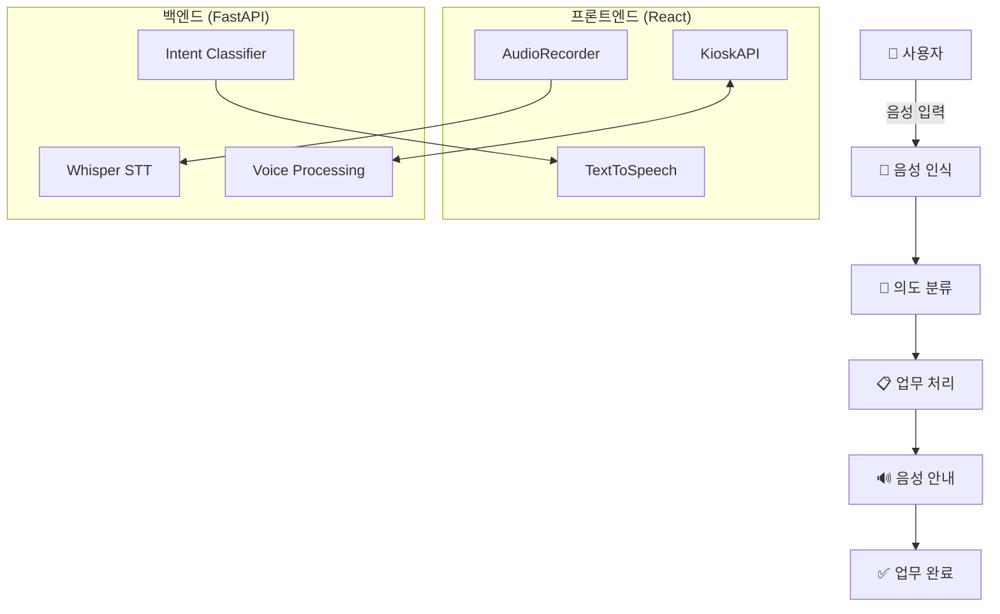

# 어르신을 위한 주민센터 음성인식 AI 키오스크

> 주민센터에서 어르신들이 쉽게 사용할 수 있는 음성인식 기반 키오스크 서비스

## 1. 프로젝트 개요

본 프로젝트는 **어르신을 위한 사용자 친화적인 음성인식 키오스크**입니다. 복잡한 터치 인터페이스 대신 음성으로 민원 업무를 안내하고 처리할 수 있어, 디지털 격차를 해소하고 접근성을 향상시킵니다.

### 주요 기능

- **음성 인식**: OpenAI Whisper 기반 한국어 음성 인식
- **의도 분류**: 머신러닝 기반 사용자 의도 자동 분류
- **음성 안내**: Web Speech API를 활용한 TTS(Text-to-Speech)
- **반응형 UI**: 어르신 친화적인 대형 버튼과 명확한 시각적 피드백
- **접근성**: WCAG 2.1 준수, 키보드 네비게이션 지원

### 시스템 아키텍처



## 2. 실행 방법

### 사전 요구사항

- **Python**: 3.8 이상
- **Node.js**: 16.0 이상
- **npm**: 8.0 이상
- **Git**: 최신 버전

### 설치 및 실행

### 1) 저장소 클론

```bash
git clone https://github.com/voice4seniors/kiosk-ai-module.git
cd kiosk-ai-module
```

### 2) 백엔드 설정

```bash
# 백엔드 디렉토리로 이동
cd kiosk_backend

# 가상환경 생성 및 활성화
python -m venv venv
source venv/bin/activate  # Windows: venv\Scripts\activate

# 의존성 설치
pip install -r requirements.txt

# 환경 검증
python check_environment.py

# 서버 실행
python run_server.py
```

### 3) AI 모델 준비

```bash
# AI 모듈 디렉토리 확인
cd ai_module

# 필수 파일 확인
ls -la *.pkl  # intent_model.pkl, vectorizer.pkl

# 모델이 없는 경우 훈련 실행
cd ../
python model.ipynb  # Jupyter Notebook 실행
```

### 4) 프론트엔드 설정

```bash
git clone https://github.com/voice4seniors/kiosk-frontend.git
```

```bash
# 프론트엔드 디렉토리로 이동
cd kiosk-frontend

# 의존성 설치
npm install

# 개발 서버 실행
npm run dev
```

### 5) 접속

- **프론트엔드**: http://localhost:5173
- **백엔드 API**: http://localhost:8000
- **API 문서**: http://localhost:8000/docs

## 3. 프로젝트 구조

```
voice4seniors/
├── ai_module/                # AI 모델 및 처리 로직
│   ├── intent_model.pkl      # 의도 분류 모델
│   ├── vectorizer.pkl        # 텍스트 벡터화 모델
│   ├── intent_predictor.py   # 의도 예측 모듈
│   ├── voice_saver.py        # 음성 저장 유틸리티
│   └── whisper_infer.py      # Whisper 추론 모듈
│
├── kiosk_backend/            # FastAPI 백엔드
│   ├── main.py               # FastAPI 애플리케이션
│   ├── config.py             # 설정 파일
│   ├── run_server.py         # 서버 실행 스크립트
│   ├── test_client.py        # 테스트 클라이언트
│   ├── check_environment.py  # 환경 검증 스크립트
│   ├── requirements.txt      # Python 의존성
│   └── README.md             # 백엔드 문서
│
└── kiosk-frontend/           # React 프론트엔드
    ├── src/
    │   ├── App.jsx           # 메인 컴포넌트
    │   ├── main.jsx          # 애플리케이션 진입점
    │   ├── App.css           # 키오스크 전용 스타일
    │   ├── index.css         # 글로벌 스타일
    │   ├── services/
    │   │   └── kioskAPI.js   # 백엔드 API 통신
    │   └── utils/
    │       ├── audioRecorder.js    # 음성 녹음 유틸리티
    │       └── textToSpeech.js     # TTS 유틸리티
    ├── index.html           # HTML 템플릿
    ├── package.json         # Node.js 의존성
    ├── package-lock.json    # Node.js 의존성 트리
    └── vite.config.js       # Vite 설정

```

## 4. 사용 기술

### 프론트엔드

- **React 19**: 최신 React 기능 활용
- **Vite**: 빠른 빌드 및 HMR
- **CSS3**: 어르신 친화적 UI/UX 디자인
- **Web APIs**: MediaRecorder, SpeechSynthesis

### 백엔드

- **FastAPI**: 고성능 비동기 웹 프레임워크
- **OpenAI Whisper**: 최첨단 음성 인식
- **Scikit-learn**: 머신러닝 의도 분류
- **Uvicorn**: ASGI 서버

### AI/ML

- **Whisper (Tiny)**: 경량화된 음성 인식 모델
- **TF-IDF + SVM**: 의도 분류 파이프라인
- **Pandas**: 데이터 처리
- **Joblib**: 모델 직렬화

## 5. 지원 업무

| 의도 ID | 업무 구분 | 설명 | 예상 소요시간 |
| --- | --- | --- | --- |
| 0 | 증명서 발급 | 주민등록등본/초본, 각종 증명서 | 5-10분 |
| 1 | 주소 변경 | 전입신고, 전출신고 | 10-15분 |
| 2 | 여권 발급 | 신규 여권 발급 및 재발급 | 20-30분 |
| 3 | 직원 호출 | 담당 직원 호출 및 상담 | 즉시 |
| 4 | 시작화면 | 메인 화면으로 돌아가기 | 즉시 |

## 6. API 엔드포인트

### 상태 확인

```
GET /health
GET /
```

### 음성 처리

```
POST /voice-to-intent
Content-Type: multipart/form-data
Body: audio file (WAV, MP3, M4A, OGG)
```

### 텍스트 처리

```
POST /text-to-intent
Content-Type: application/json
Body: {"text": "주민등록등본 발급해주세요"}
```

### 업무 처리

```
POST /process-intent/{intent_id}
GET /intents
```

### 개발자 도구

```
GET /demo/examples
POST /demo/simulate-voice
```

## 7. 사용자 인터페이스

### 주요 화면

1. **홈 화면**: 음성 입력 대기 상태
2. **음성 인식**: 실시간 음성 입력 처리
3. **결과 확인**: 인식된 내용 및 의도 표시
4. **업무 처리**: 선택된 업무의 다음 단계 안내

### 디자인 원칙

- **어르신 친화적**: 큰 글씨, 명확한 색상 대비
- **직관적 네비게이션**: 단순하고 예측 가능한 흐름
- **접근성 준수**: 스크린 리더, 키보드 네비게이션 지원
- **반응형 디자인**: 다양한 화면 크기 지원

## 8. 테스트

### 백엔드 테스트

```bash
# 환경 검증
python check_environment.py

# API 테스트
python test_client.py

# 개별 모듈 테스트
python -m pytest tests/
```

### 프론트엔드 테스트

```bash
# 빌드 테스트
npm run build

# 린트 검사
npm run lint

# 프리뷰 서버
npm run preview
```

### 음성 테스트 예제

```
✅ "주민등록등본 발급해주세요"
✅ "전입신고 하러 왔어요"
✅ "여권 만들고 싶어요"
✅ "직원 좀 불러주세요"
✅ "처음으로 돌아가고 싶어요"
```

## 9. 문제 해결

### 1) 음성 인식이 안 될 때

```bash
# 브라우저 권한 확인
- Chrome: 설정 > 개인정보 보호 및 보안 > 사이트 설정 > 마이크
- HTTPS 환경에서만 동작 (localhost 제외)
```

### 2) AI 모델 로드 실패

```bash
# 모델 파일 확인
ls -la ai_module/*.pkl

# 모델 재훈련
cd ai_module
python model.ipynb
```

### 3) 디버깅 모드

```bash
# 백엔드 디버그 모드
DEBUG=True python run_server.py

# 프론트엔드 디버그 모드
npm run dev -- --debug
```
